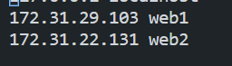
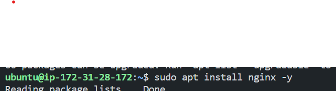
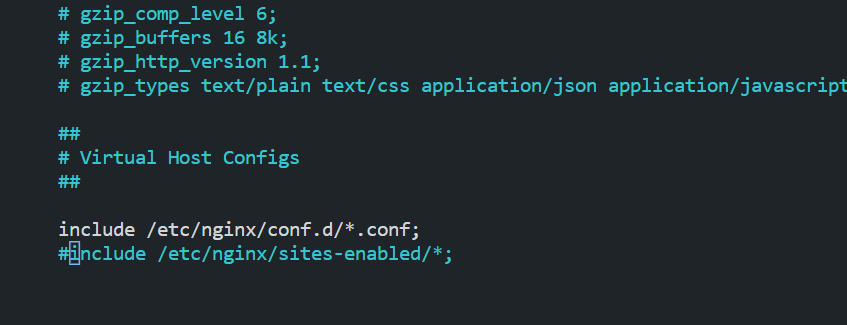
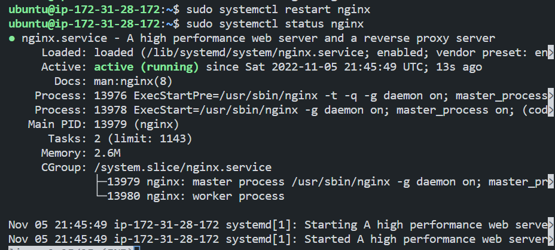
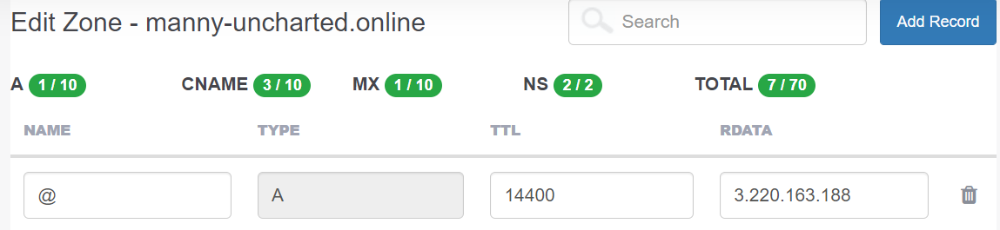

# LOAD BALANCER SOLUTION WITH NGINX AND SSL/TLS

## Table of Contents
- [Introduction](#introduction)
- [Prerequisites](#prerequisites)
- [Configure Nginx as a Load Balancer](#configure-nginx-as-a-load-balancer)
- [Register a domain name and configure secured connection using ssl/tls certificcates](#register-a-domain-name-and-configure-secured-connection-using-ssl/tls-certificcates)


## Introduction
By now you have learned what Load Balancing is used for and have configured an LB solution using Apache, but a DevOps engineer must be a versatile professional and know different alternative solutions for the same problem. That is why in this project we will configure an Nginx Load Balancer solution.

It is also extremely important to ensure that connections to your Web solutions are secure and information is encrypted in transit – we will also cover connection over secured HTTP (HTTPS protocol), its purpose and what is required to implement it.

When data is moving between a client (browser) and a Web Server over the Internet – it passes through multiple network devices and, if the data is not encrypted, it can be relatively easily intercepted by someone who has access to the intermediate equipment. This kind of information security threat is called Man-In-The-Middle (MIMT) attack.

This threat is real – users that share sensitive information (bank details, social media access credentials, etc.) via non-secured channels, risk their data being compromised and used by cybercriminals.

SSL and its newer version, TSL – is a security technology that protects the connection from MITM attacks by creating an encrypted session between the browser and Web server. Here we will refer to this family of cryptographic protocols as SSL/TLS – even though SSL was replaced by TLS, the term is still being widely used.

SSL/TLS uses digital certificates to identify and validate a Website. A browser reads the certificate issued by a Certificate Authority (CA) to make sure that the website is registered in the CA so it can be trusted to establish a secured connection.

There are different types of SSL/TLS certificates – you can learn more about them here. You can also watch a tutorial on how SSL works here or an additional resource here

In this project you will register your website with LetsEnrcypt Certificate Authority, to automate certificate issuance you will use a shell client recommended by LetsEncrypt – cetrbot.


## Prerequisites
This project consists of two parts:
- Infrastructure: AWS.
- Webserver Linux: Red Hat Enterprise Linux 8.
- Database Server: Ubuntu 20.04 + MySQL.
- Storage Server: Red Hat Enterprise Linux 8 + NFS Server.
- Load Balancer: Ubuntu 20.04.
- Programming Language: PHP.
- Configure Nginx as a Load Balancer
- Register a new domain name and configure a secured connection using SSL/TLS certificates.
- Your target architecture will look like this:


## Configure Nginx as a Load Balancer
Here we can decide to create a fresh installation of Linux for Nginx or use the same Linux server that we used for Apache. In this project, we will create a fresh installation of Linux for Nginx.


- Create an EC2 VM based on Ubuntu 20.04 and name it Nginx LB and also open a TCP port 80 for HTTP connections, also open port 443 for HTTPS connections.


- Update /etc/hosts file for local DNS with the names of the web servers and their local IP addresses.

Results:



- Install and configure Nginx as a load balancer to point traffic to the resolvable DNS names of the webservers
```
sudo apt update
sudo apt install nginx
```

Results:



- configure Nginx Load balancer using web server names defined in /etc/hosts.

Open the Nginx configuration file for editing:

```
sudo nano /etc/nginx/nginx.conf
```
and insert the following configuration into the HTTP section:

```
 upstream myproject {
    server Web1 weight=5;
    server Web2 weight=5;
  }

server {
    listen 80;
    server_name www.domain.com;
    location / {
      proxy_pass http://myproject;
    }
  }
```
then comment out this line in the HTTP section:

```
include /etc/nginx/sites-enabled/*;
```
Results:



- Restart Nginx and make sure the service is up and running:

```
sudo systemctl restart nginx
sudo systemctl status nginx
```

Results:



## Register a domain name and configure a secured connection using SSL/tls certificates.

In this section, we would be working on making the necessary configurations to ensure that the connection to our tooling web solution is secure.

To get a valid SSL certificate, we need to register a domain name and configure a secured connection using SSL/TLS certificates.

- Register a domain name with a domain name registrar. You can use any domain name registrar of your choice. In this project, we will use whogohost.com. You can also use any other domain name registrar of your choice.

Results:


- Assign an Elastic IP to the Nginx LB server. To lean how to assign an Elastic IP to an EC2 instance, you can read this <a href="https://docs.aws.amazon.com/AWSEC2/latest/UserGuide/elastic-ip-addresses-eip.html">article</a>.

Results:


- Update A record for the domain name to point to the Elastic IP of the Nginx LB server.

Note: To learn how to update A record for the domain name to point to the Elastic IP of the Nginx LB server, you can read this <a href="https://medium.com/progress-on-ios-development/connecting-an-ec2-instance-with-a-godaddy-domain-e74ff190c233">article</a>.

Results:
